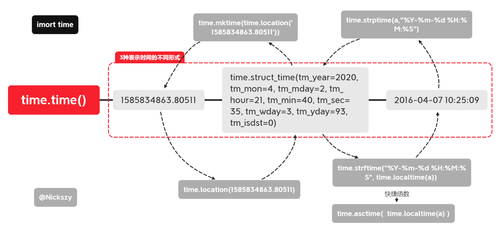

# 时间处理

想要准确的表达现在是几点并非一件容易事，你需要知道时区、年份、月份、日子、时、分、秒等数据。

python中最基础的时间库是`time`,`datetime`则赋予了时间更多的可玩性，而`pandas`中的时间戳也非常有意思。


## time

time 是 python 中的标准库，他实现的更多的是与内核相关的时间操作。



## datetime

datetime 是也是 python 的标准库，当它依赖于 time 的一些函数，有点类似于 matplotlib 和 seaborn 的关系。

```
object
    timedelta
    tzinfo
        timezone
    time
    date
        datetime
```


[the-distinction-between-date-and-datetime-in-python/](http://gracece.com/2014/10/the-distinction-between-date-and-datetime-in-python/)

## 进阶

### pytz

uts

### bisnuss calender

### calender

### [momentjs](http://momentjs.cn/)是一个 javascript 的时间处理库，也值得大家借鉴。
